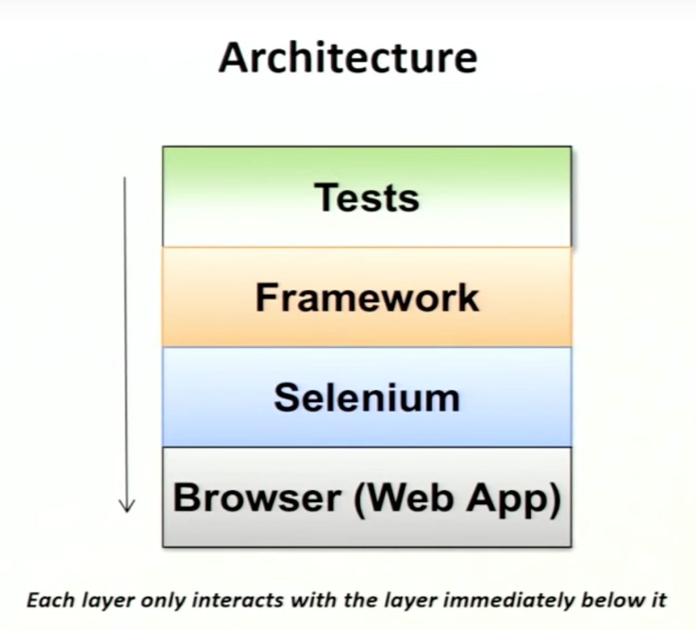

# qa-automation-java

Step-by-step guide:

## Install GIT on your terminal
Follow Steps From https://gist.github.com/derhuerst/1b15ff4652a867391f03#file-mac-md

git clone https://github.com/ClipMX/qa-automation-java.git

Input username and password

## IntelliJ:
Go to https://www.jetbrains.com/idea/download/#section=mac and click on the "Download" under ultimate button: 

Follow the install steps and just use the default settings and follow the next steps on importing `qa-automation-java` project

## Java project setup:
Open IntelliJ

Click File->New->Project from existing sources

Make sure IntelliJ builds project from maven source

## Maven setup:
Download maven here: `https://maven.apache.org/download.cgi`
Extract the folder
Add the bin directory to your PATH by:
1. Navigate in your terminal to the qa-automation-java repository
2. Edit the following command by replacing /Users/.. with the path to where you stored the maven bin folder
   1. This is how mine looked: `export PATH=/Users/joshuapeterson/Documents/apache-maven-3.5.2/bin:$PATH`
   2. Run the command in your terminal
Run `mvn --version` to confirm it's been installed
Run `mvn install`

## Running Automation
Look at the xml inside src folder 
In IntelliJ right click the xml file and find the TestNG image that says `Create usrDirToXML ...`

If automation does not start, right click on the `qa-automation-java` dir in IntelliJ -> Open Module Settings -> Sources Tab

Mark src directory as a src folder and try clicking the play button on the top bar of IntelliJ

###Running Automation From Command Line
In terminal all user has to do is go to working directory for `qa-automation-java`

In terminal type `mvn test -Dxml=src/test.xml` Or change to other xml file

Automation should automatically start

## Getting Started Helpers
- https://youtu.be/DO8KVe00kcU
- 

## Organization Standards:
- **com.clip.framework** -> framework and test packages
- **com.clip.framework.pages** -> page object definition classes for each app
- **com.clip.tests** -> tests for each app

## Naming conventions  
- Use **camelCase** for naming
- Constants should be all **UPPERCASE**
- Class names should start with a **capitol** letter
- Naming should be descriptive and meaningful (someone withough any coding experience should be able to look at the tests and know what they do)
- Methods should have naming that mimics the page (high level functionality)
  - login()
  - resetPassword()
  - toggleRememberMe()

## Best Practices
- Use the Page Object pattern
- Always try and stay DRY (Don't Repeat Yourself)
- Methods should do one thing, and do that one thing well
- One assert per test
- Declare class variables at the top of the class (in the framework/page object)
- Tests should not contain references to selectors. (All Selectors should be declared in the framework/page object)
- Seperate errors from failures (example: If an element can't be found it is an error, if the assert fails it's a failure) 

### Always
1. ALWAYS reduce the number of parameters for API calls when possible
2. ALWAYS use default values instead of requiring parameters when possible (generators help with this)

### Prefer
1. PREFER to make the API easier to use over making the internals of the API less complex
2. PREFER using enumerations and constants to requiring the test to pass in primitive types
